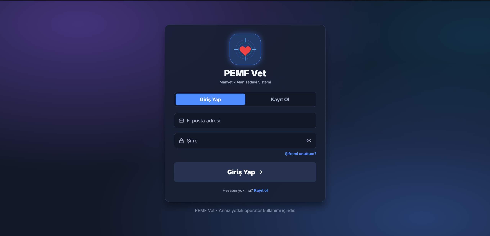
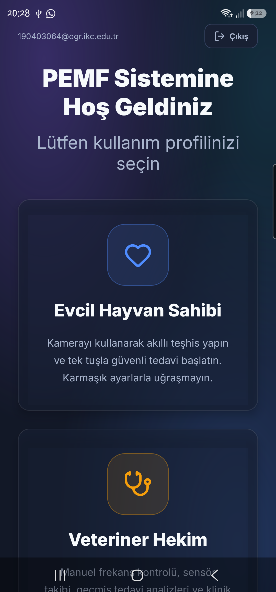
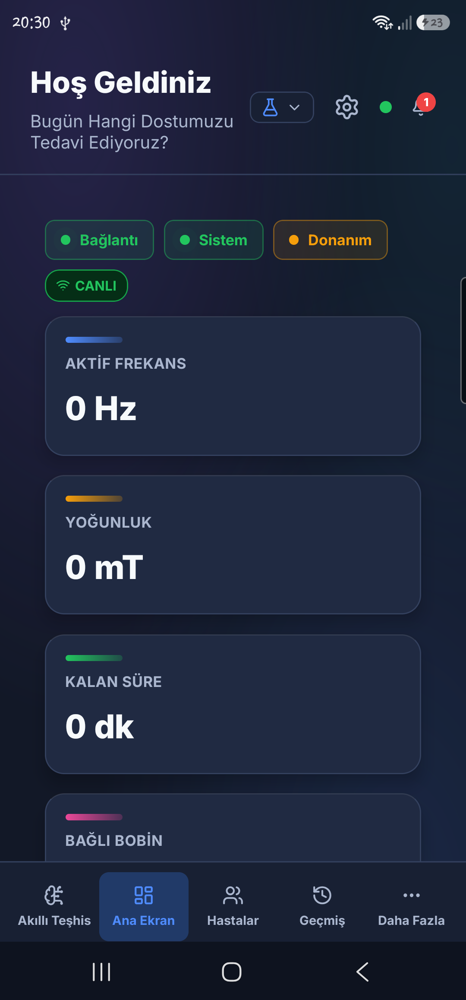
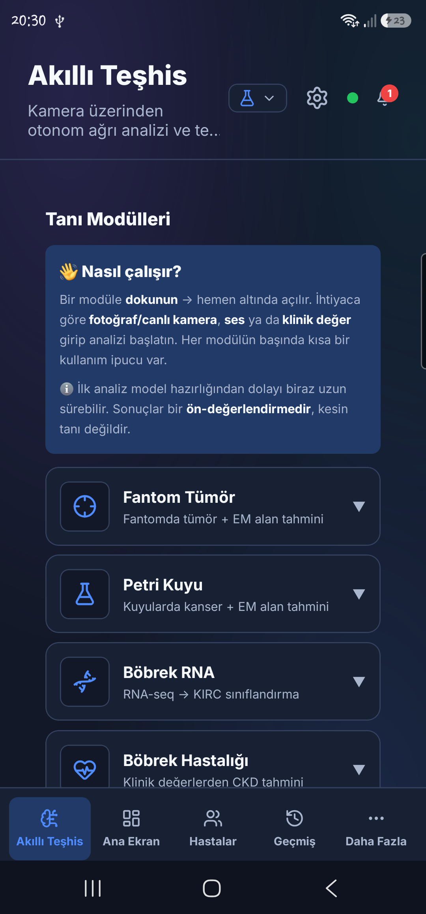
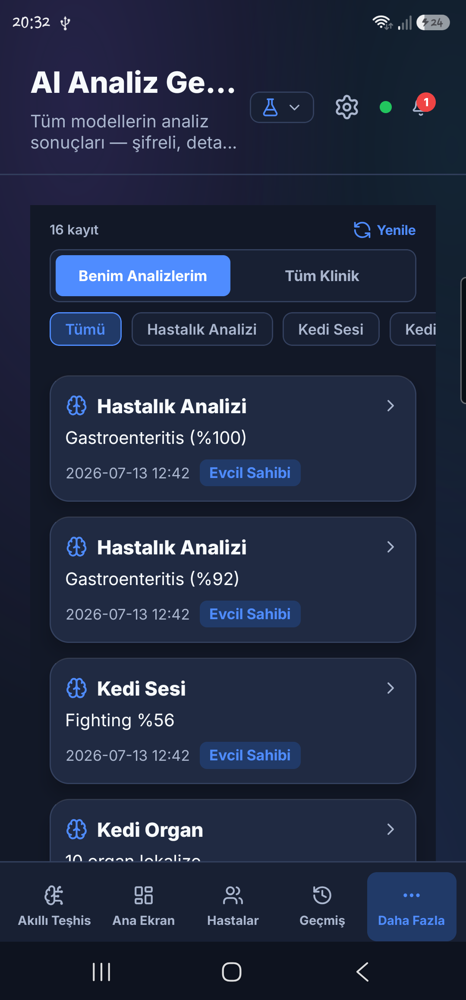

# PEMF Veteriner Cihazı — Proje Kökü (`guii`)

Bu depo, **PEMF veteriner terapi cihazının** tüm yazılımıdır: arayüzsüz (**headless**) Python backend'i,
React Native/Expo mobil+web uygulaması, yapay-zekâ teşhis modelleri, Tauri ince-istemci (launcher) ve
tüm build/dağıtım zinciri — hepsi **tek klasörde**.

> **Yeni geliştiriciysen buradan başla.** Aşağıdaki **dizin haritası** her üst-klasörün kendi `README.md`'sine
> link verir; oradan alt-sisteme inersin. Build için → [`BUILD.md`](BUILD.md). Mimari için → [`docs/ARCHITECTURE.md`](docs/ARCHITECTURE.md).

> **Önemli:** Tüm AI modelleri EXE'ye **gömülüdür** (offline, self-contained). **Hugging Face indirme kaldırıldı** — runtime internet gerektirmez.

---

## Arayüz — Ekran Görüntüleri

Arayüz **React Native / Expo** ile tek kod tabanından **Web + Android + iOS**'te çalışır. Üç profil —
**Evcil Hayvan Sahibi · Veteriner Hekim · Araştırma Modu** — arayüzü kullanıcıya göre uyarlar.

<p align="center">
  <br/>
  <em>Kimlik doğrulama — Supabase tabanlı e-posta doğrulama + şifre sıfırlama.</em>
</p>
<p align="center">
  
  
  
  
</p>
<p align="center"><em>Profil Seçimi · Araştırma Modu ana ekran · Akıllı Teşhis (AI Hub) · Şifreli AI Analiz Geçmişi.</em></p>

---

## Büyük Resim

```
Mobil/Web (pf → frontend/dist)  ──LAN http/ws :8000 · uzak: Cloudflare tünel──▶  PEMF_Backend.exe
                                                                                  (FastAPI+uvicorn, NSSM servis)
   Supabase (yalnız cihaz-registry + şifreli PII)                                   ├─ servers/  (REST+WS+router'lar)
   GitHub Releases (OTA: base.zip/APK/launcher)                                     ├─ controllers/ → STM32 (bobin 1-5, seri)
                                                                                    ├─ services/ + bin/mosquitto → ESP (bobin 6-8, MQTT)
                                                                                    ├─ database/ (SQLCipher yerel)
                                                                                    └─ ai_hub/ (gömülü ONNX teşhis)
```
Detaylı bileşen diyagramı, veri akışı ve güven sınırları: [`docs/ARCHITECTURE.md`](docs/ARCHITECTURE.md).

## Sürümler — tek kaynak [`versions.json`](versions.json)

| Kanal | Sürüm | Hedef dosya |
|---|---|---|
| Backend / installer | **1.9.5** (`VERSION`) | `PEMF_Backend_Setup.iss`, `docs/version_info.txt` |
| Launcher (client) | **1.9.5** | `launcher/Cargo.toml`, `launcher/app/tauri.conf.json` |
| Mobil (APK/IPA) | **2.3.3** (vc10 / iOS 5) | `pf/app.json` |
| Frontend OTA | **1.4.1** | `frontend_version.json` |

> Sürümü **elle `versions.json`'da** değiştir → `build_tools/sync_versions.ps1` hedef dosyalara yazar (build başında otomatik).

---

## Dizin Haritası — Neyin Ne Olduğu

### Backend (Python, headless)
| Klasör | Ne işe yarar |
|---|---|
| `backend_service.py` · `headless_core.py` · `event_bus.py` | **Giriş noktası** (main), Qt-siz çekirdek (STM seri + kuyruk), pub/sub olay veri yolu |
| [`servers/`](servers/README.md) | FastAPI uygulaması: REST + WebSocket + tüm router'lar + canlı durum + ağ (tünel/mDNS/sync) |
| [`controllers/`](controllers/README.md) | STM32 bobin kontrol choke-point'i (keep-alive + süre-watchdog + garantili STOP) |
| [`services/`](services/README.md) | Mosquitto/ağ-durumu/UDP-keşif süpervizörleri + cihaz kimlik-bilgileri + DB bakımı |
| [`database/`](database/README.md) | Yerel SQLite/**SQLCipher** kalıcılık (hasta/seans/sensör/auth) + MQTT outbox |
| [`utils/`](utils/README.md) | STM32 seri/protokol-limit, sırlar, yollar, config, PDF, telemetri, model-çözüm (offline) |
| [`ai/`](ai/README.md) | Kural-tabanlı **tedavi-parametre önerisi** + global AI config (teşhis DEĞİL) |
| [`pemf_gui/`](pemf_gui/README.md) | Eski PyQt GUI kalıntısı — GUI ölü, ama `config.py`+ikon shim'i **canlı** (backend import eder) |
| [`config/`](config/README.md) | Uygulama config'i (MQTT/timer/performans) + `credentials/` (sır) |
| [`data/`](data/README.md) | Küçük seed/geliştirme verisi — çoğu bayat (gerçek DB app-data'da) |

### Yapay Zekâ
| Klasör | Ne işe yarar |
|---|---|
| [`ai_hub/`](ai_hub/README.md) | Teşhis modeli **kodu** (13+ model) + gömülü küçük ağırlıklar + `PEMF_AI_Test_Girdileri/` |
| [`ai_service/`](ai_service/README.md) | Bağımsız **GPU (CUDA) inference mikroservisi** (:8100, onnxruntime-gpu, opsiyonel) |
| [`release_assets/`](release_assets/README.md) | **Model ağırlık deposu (2.1 GB) TEK-KAYNAK** + `PEMF_Vet_Mobil.apk` |

### Frontend / Web
| Klasör | Ne işe yarar |
|---|---|
| [`pf/`](pf/README.md) | **ANA KAYNAK** — mobil (APK/IPA) + web bundle üreten React Native/Expo kaynağı |
| [`frontend/`](frontend/README.md) | **ÜRETİLEN** — `dist/` = backend'in `/` kökünden sunduğu web bundle (pf'ten aynalanır); `src/` ölü |
| [`pemf-vet-web/`](pemf-vet-web/README.md) | **Canlı pazarlama/indirme sitesi** (Vite+React, Vercel, iyzico ödeme) |
| [`pemf_vet_landing/`](pemf_vet_landing/NOTES.md) | Çıkarılmış Lovable landing statik kopyası (tasarım referansı) |
| [`web_static/`](web_static/README.md) · [`website/`](website/README.md) · [`templates/`](templates/README.md) | **LEGACY** — eski vanilla UI · eski indirme sayfası · eski sunucu-render şablonu (hiçbiri kullanılmıyor) |

### Build / Dağıtım / Launcher
| Klasör/Dosya | Ne işe yarar |
|---|---|
| [`BUILD.md`](BUILD.md) | **Ana build rehberi** (backend/base.zip/launcher/APK/installer + yayın) |
| `bootstrap.ps1` | Sıfır-makinede tüm toolchain'i tek komutla kurar (Node/Rust/MSVC/JDK/Android/Inno/gh) |
| [`build_tools/`](build_tools/README.md) | Derleme reçeteleri (PyInstaller spec, Inno .iss, `make_base_zip.py`, `build_apk.ps1`, sürüm-lock) |
| [`scripts/`](scripts/README.md) | Ops: build/yayın/servis-kurulum/gateway-hotspot/teardown-uninstall |
| [`PEMF_BUILD/`](PEMF_BUILD/README.md) | **ÜRETİLEN** — kanonik frozen-backend çıktısı (`dist/PEMF_Backend`, base.zip girdisi) |
| `build/` · `dist/` | **ÜRETİLEN** — PyInstaller varsayılan-konum ikizleri (regenerable) |
| [`pemf-app-packages/`](pemf-app-packages/README.md) | Güncelleme-sunucusu hazırlık: `base.zip` + `manifest.json` |
| [`launcher/`](launcher/README.md) | **Tauri v2 ince istemci** ("PEMF Vet Client") — indirir/doğrular/backend'i başlatır, kendini günceller |
| [`deploy/`](deploy/README.md) | `device.env` / `server.env` / `staging.env` dağıtım profilleri |
| [`offline dağıtım/`](offline%20dağıtım/OKU-README.md) | İnternetsiz USB kurulum (Inno DiskSpanning `.bin` dilimleri) |
| [`docker/`](docker/DOCKER_README.md) | Container'lar: backend/AI + frontend nginx + GPU AI (3 compose profili) |
| [`bin/`](bin/README.md) | Gömülü ikililer: mosquitto (MQTT), cloudflared (tünel), nssm (servis) |
| [`lattekurulum/`](lattekurulum/README.md) | LattePanda klinik mini-PC kurulum yardımcıları |

### Firmware · Test · CI · Diğer
| Klasör | Ne işe yarar |
|---|---|
| [`firmware/`](firmware/README.md) | STM32F429 bobin-sürücü firmware'i (`main.c`, yazılım DDS PWM + güvenlik watchdog) |
| [`tests/`](tests/README.md) | pytest paketi (28 test; protokol-güvenlik, auth, KVKK, seans, OTA) |
| [`tools/`](tools/README.md) | Geliştirici araçları (STM32 simülatör :5100, COM sniffer, test-verisi) |
| [`.github/`](.github/README.md) | CI (tests/lint/security/linux-mac backend/launcher/testflight) + dependabot |
| [`docs/`](docs/README.md) | Dokümanlar (mimari, launcher-sözleşmesi, runbook, doğrulama, sistem-raporu) + ekran görüntüleri |
| [`icon_master/`](icon_master/README.md) | Uygulama ikonu kaynak görselleri |
| [`apple-mac-cert/`](apple-mac-cert/README.md) | ⚠️ Apple kod-imzalama/notarization materyali (SIR — gitignore+rotate gerekir) |
| [`dema-terapi-simülatörü/`](dema-terapi-simülatörü/README.md) | Bağımsız demo terapi simülatörü (React+Vite; backend'e bağlı değil) |

---

## Build & Dağıtım (özet)

Tam adım-adım: **[`BUILD.md`](BUILD.md)**. En kısa hâli (guii kökünden):

| Hedef | Komut | Çıktı |
|---|---|---|
| Backend (frozen EXE) | `.\scripts\build_backend_exe.ps1` | `PEMF_BUILD\dist\PEMF_Backend\` |
| base.zip (client runtime) | `python build_tools\make_base_zip.py` | `pemf-app-packages\base.zip` |
| Launcher (installer) | `cd launcher\app; npx @tauri-apps/cli build` | `...\nsis\...setup.exe` |
| Web frontend | `cd pf; npm run export:web` + mirror | `frontend\dist` |
| Android APK | `.\build_tools\build_apk.ps1` | `release_assets\PEMF_Vet_Mobil.apk` |

- **Runtime taşınabilir:** frozen EXE / offline installer Python KURULU OLMADAN her makinede çalışır.
- **Build taşınabilir değil ama otomatik:** `bootstrap.ps1` boş bir Windows'ta tüm araç zincirini kurar.
- **Build Python'ı = gömülü** (klasör kökündeki `python.exe`; myenv + sistem Python **kaldırıldı**, gerekmez).
- Dağıtım (device/server): [`deploy/README.md`](deploy/README.md).

## Önemli Kurallar (yeni geliştirici — bunları bozma)

- 🔒 **Cihaz güvenliği:** bobinler her kill/kaldırmadan **önce** E-stop'lanır (launcher + teardown). Süre-watchdog + keep-alive + firmware "Ölü Adam Devresi" katmanlı korumadır.
- 🔒 **Backend Python-tarafı freq/duty/sıcaklık clamp'i YOK** (bilinçli) — firmware sınırda doyurur. Sınır sabitleri `utils/stm32_protocol_limits.py`.
- 🔒 **PII maskeleme varsayılan KAPALI** (bilinçli sahip kararı) — `PEMF_MASK_HISTORY_PII=1` ile açılır.
- 🌐 **AI offline** — `utils/model_downloader.py` yalnız yerel kökleri arar; internetten model çekmez.
- ✏️ Web/mobil UI'yi **`pf/`'te düzenle** — `frontend/src` bayat kopyadır.
- 🚀 **Launcher AYRI yayınlanır** (base.zip/APK republish onu güncellemez).

---
İlgili: [BUILD.md](BUILD.md) · [docs/ (doküman indeksi)](docs/README.md) · [ARCHITECTURE.md](docs/ARCHITECTURE.md) · [RUNBOOK.md](docs/RUNBOOK.md)

## Son değişiklikler — 2026-08-06

| Alan | Değişiklik |
|---|---|
| **AI güvenliği** | Görüntü **modalite denetimi** (`utils/image_domain.py`) — yanlış türde görüntüye güvenle teşhis üretilmesi engellendi (CT → Patoloji "Grade 4 · %100" vakası). Petri için ayrıca **geometri makullik** katmanı (`ai_hub/inference_petri_dish/plausibility.py`). Kapatma: `PEMF_AI_DOMAIN_GUARD=0`. |
| **Client girişi** | Client açılışta Supabase girişi + **Beni hatırla** (DPAPI). Oturum backend'e devredilir (`/api/auth/desktop-session` — yalnız 127.0.0.1, yalnız bellekte) → **uygulamada çift login yok**. Mobilde client olmadığı için mevcut akış aynı kalır. |
| **Çevrimdışı açılış** | Manifest ve kimlik kapısı artık boot'u BLOKLAMIYOR — internetsiz klinikte client açılır, kurulu cihazda "Başlat" çalışır. Eskiden "Ortam algılanıyor…" ekranında kilitleniyordu. |
| **Profiller** | Araştırma Modu'na Kontrol · Hastalar · Sensörler · Raporlar · Simülasyon eklendi; **üç profilde de** Ayarlar'dan sonra "Çıkış Yap" (bobin çalışırken teardown-guard'a bağlı). |
| **MQTT** | `client_id` süreç/çağrı başına benzersiz — sabit kimlik, paralel yayın yapan acil-durdurmada STOP komutunu kaybettirebiliyordu. |
| **Android imzalama** | **Release keystore üretildi** (4096-bit RSA, 2053'e kadar geçerli). APK artık release-imzalı. ⚠️ Anahtar yedeği ve uyarılar: [keys/README.md](keys/README.md) — kaybolursa uygulama bir daha güncellenemez. |
| **Site** | İndirme öncesi kayıt/giriş kapısı. Windows client `launcher-v1.9.9`; Android **kendi etiketine** taşındı — eskiden mac/linux ile ortak etiket kullandığından site APK güncellense bile hep eski sürümü veriyordu. |

**Yayındaki sürümler:** Backend/App `1.9.5` · Launcher `1.9.9` · Mobil `2.3.3 (versionCode 10)`
Sürüm tek kaynağı: `versions.json` → `build_tools/sync_versions.ps1`
